### <h1 align="center"> 🏹🏹 Les Archers Du Castel V2 🏹🏹 - Portfolio Symfony</h1>

Site web réalisé pour le club d’archerie « Archers du Castel ». 
Il présente les informations principales du club : 
Son histoire, les horaires et les tarifs, ainsi que des contenus multimédias tels que des photos des compétitions 
et des vidéos pédagogiques sur les postures et l’entretien de l’arc.

Le site inclut également un agenda pour les rendez-vous importants et un espace administrateur permettant de gérer facilement le contenu
grâce à une base de données MySQL. Développé avec PHP et Symfony, il combine interface publique pour les visiteurs 
et fonctionnalités sécurisées pour les administrateurs.

### 🏠 Page d’accueil  
  
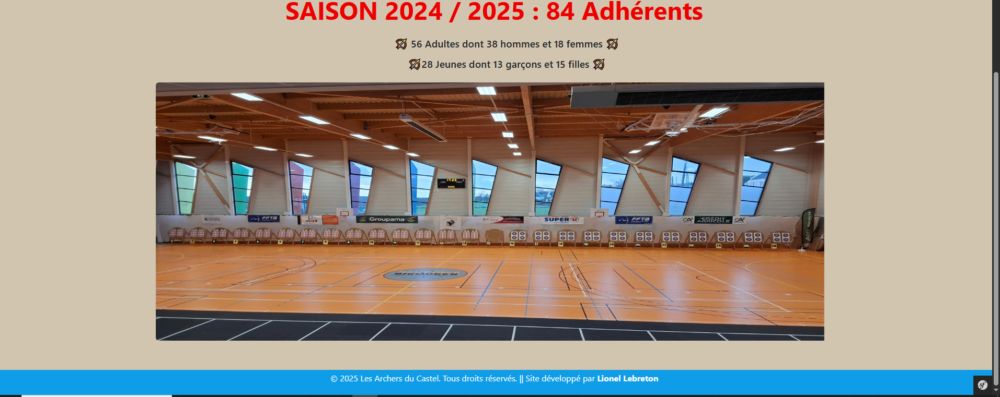  

### 💬Page popup est disponible en mode administrateur.
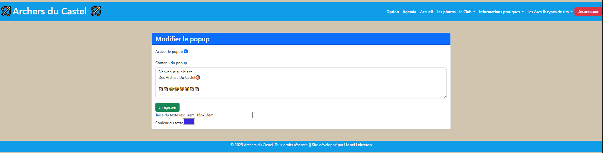 

### 💬Page popup visible sur la première page
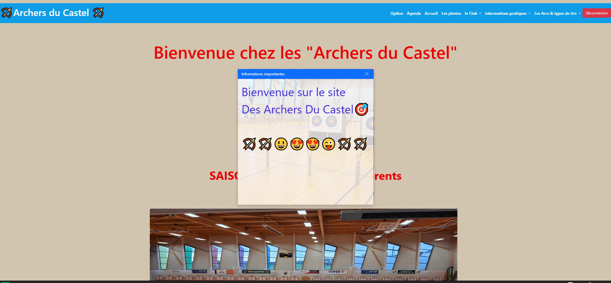 

### 📷 photo

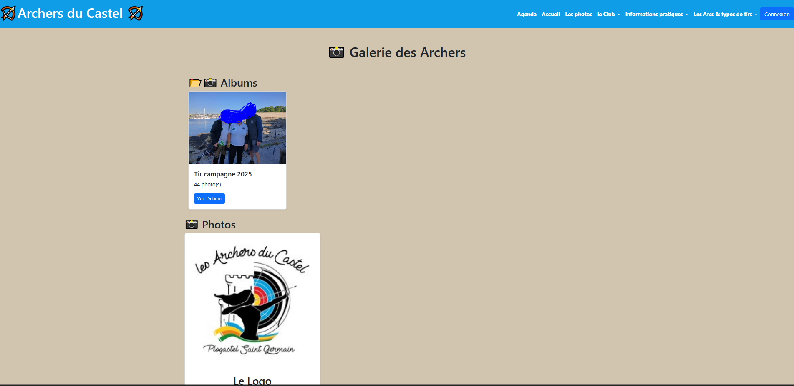 
### En mode administrateur:
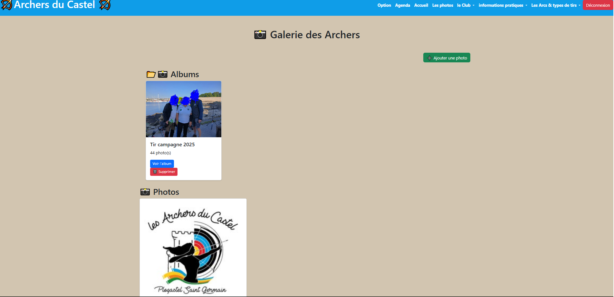 
### Le formulaire d’ajout est disponible en mode administrateur.
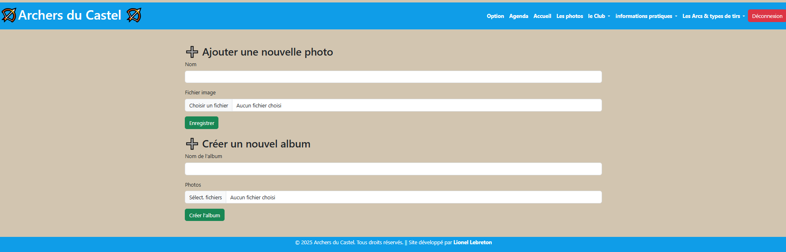 

### 📅 Agenda
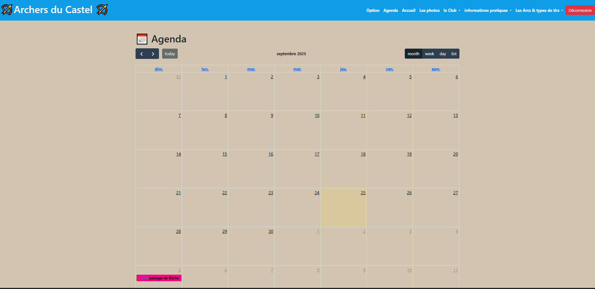 
Le formulaire d’ajout  ou de mondification est disponible en mode administrateur.
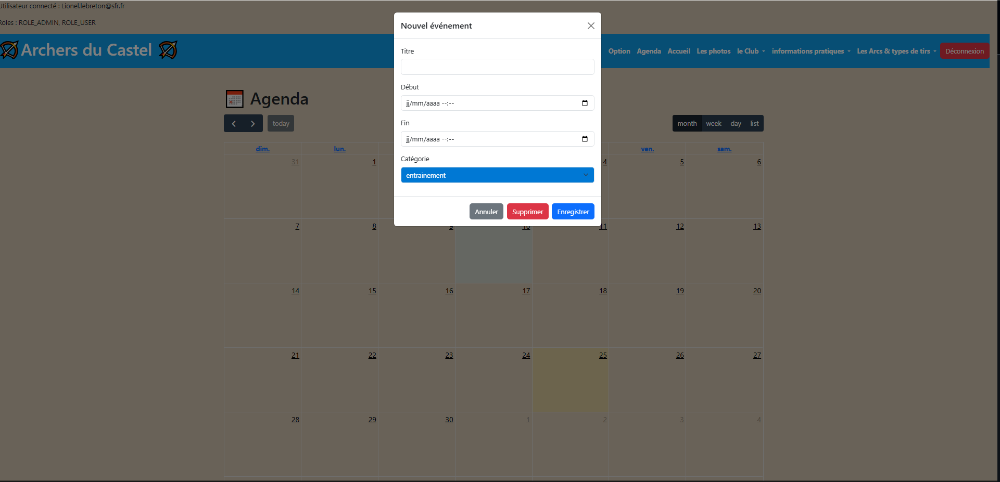 
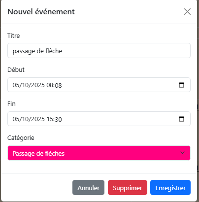 

### 📰 Horaires 
 
  

### 🖼️ Le Club   
 
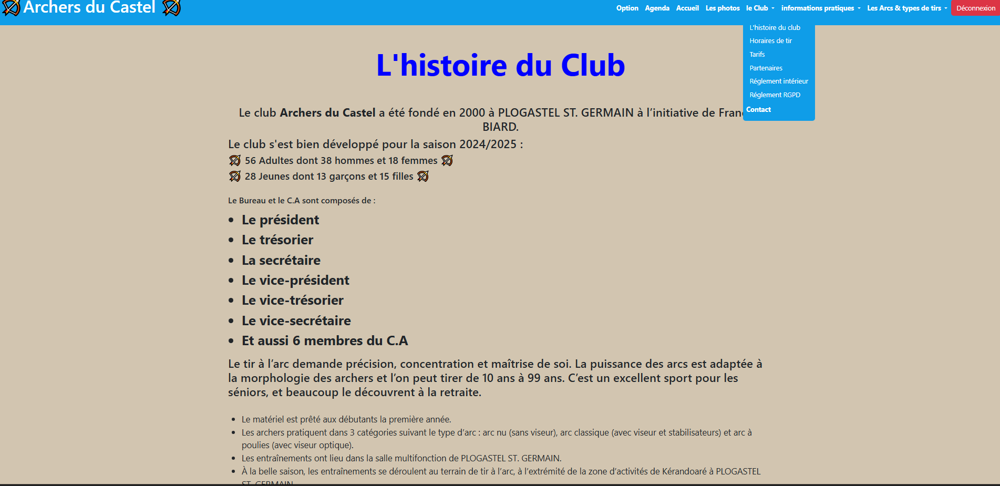  

### 🎥 Posture et Formation
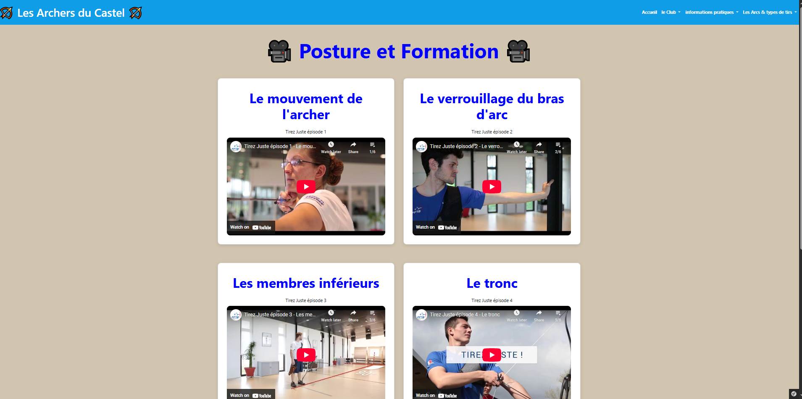  

### 🎥 L'arc 🎥
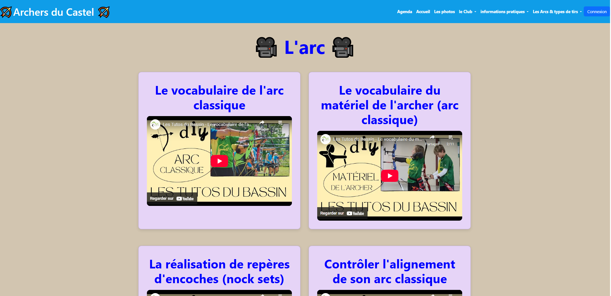

## Description
- Symfony version 7.3.3
- PHP 8.2.12 (cli)
- Frontend responsive, HTML, CSS, JS
- Pages : Packages PHP : Twig, Doctrine, etc.
  
